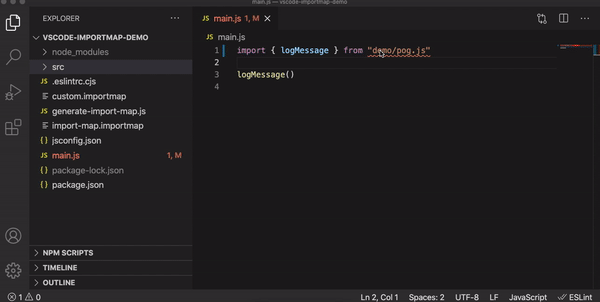

# Node module import map

Generate importmap for node_modules.

[](https://www.npmjs.com/package/@jsenv/node-module-import-map)
[](https://github.com/jsenv/jsenv-node-module-import-map/actions?workflow=ci)
[](https://codecov.io/gh/jsenv/jsenv-node-module-import-map)

# Presentation

This repository generates [import map](https://github.com/WICG/import-maps) from `package.json` files in your `node_modules` directory. The generated importmap can be used to make code dependent of node module executable in a browser.

<details>
  <summary>See code relying on node module resolution</summary>

```js
import lodash from "lodash"
```

The code above is expecting Node.js to "magically" find file corresponding to `"lodash"`. This magic is the [node esm resolution algorithm](https://nodejs.org/docs/latest-v16.x/api/esm.html#esm_resolution_algorithm). Other runtimes than Node.js, a browser like Chrome for instance, don't have this algorithm. Executing that code in a browser fetches `http://example.com/lodash` and likely results in `404 File Not Found` from server.

</details>

# Usage

<details>
  <summary>1 - Install <code>@jsenv/node-module-import-map</code></summary>

```console
npm install --save-dev @jsenv/node-module-import-map
```

</details>

<details>
  <summary>2 - Create <code>generate-import-map.js</code></summary>

```js
import { getImportMapFromProjectFiles, writeImportMapFile } from "@jsenv/node-module-import-map"

const projectDirectoryUrl = new URL("./", import.meta.url)

await writeImportMapFile(
  [
    getImportMapFromProjectFiles({
      projectDirectoryUrl,
    }),
  ],
  {
    projectDirectoryUrl,
    importMapFileRelativeUrl: "./project.importmap",
  },
)
```

The code above is written in ESM. You may have to use `.mjs` extension to run it with Node.js as documented in [enabling ESM](https://nodejs.org/docs/latest-v16.x/api/esm.html#esm_enabling)

</details>

<details>
  <summary>3 - Generate <code>project.importmap</code></summary>

```console
node generate-import-map.js
```

</details>

<details>
  <summary>4 - Add <code>project.importmap</code> to your html</summary>

```html
<!DOCTYPE html>
<html>
  <head>
    <title>Title</title>
    <meta charset="utf-8" />
    <link rel="icon" href="data:," />
    <script type="importmap" src="./project.importmap"></script>
  </head>

  <body>
    <script type="module">
      import lodash from "lodash"
    </script>
  </body>
</html>
```

If you use a bundler or an other tool, be sure it's compatible with import maps. As import map are standard the bundler/tool might be compatible by default or with the help of some plugin/configuration. [@jsenv/core](https://github.com/jsenv/jsenv-core) seamlessly supports importmap during development, testing and when building for production.

</details>

# API

## writeImportMapFile

`writeImportMapFile` is an async function receiving an array of promise resolving to importmaps. It awaits for every importmap, compose them into one and write it into a file.

<details>
  <summary>writeImportMapFile code example</summary>

Code below generate an import map from node_modules + an inline importmap.

```js
import { getImportMapFromProjectFiles, writeImportMapFile } from "@jsenv/node-module-import-map"

const projectDirectoryUrl = new URL("./", import.meta.url)
const importMapInputs = [
  getImportMapFromProjectFiles({
    projectDirectoryUrl,
    dev: true,
  }),
  {
    imports: {
      foo: "./bar.js",
    },
  },
]

await writeImportMapFile(importMapInputs, {
  projectDirectoryUrl,
  importMapFileRelativeUrl: "./import-map.importmap",
})
```

[implementation](./src/writeImportMapFile.js)

</details>

<details>
  <summary>importMapInputs parameter</summary>

`importMapInputs` is an array of importmap object or promise resolving to importmap objects. This parameter is optional and is an empty array by default.

> When `importMapInputs` is empty a warning is emitted and `writeImportMapFile` write an empty importmap file.

</details>

<details>
  <summary>importMapFile parameter</summary>

`importMapFile` parameter is a boolean controling if importMap is written to a file. This parameters is optional and enabled by default.

</details>

<details>
  <summary>importMapFileRelativeUrl parameter</summary>

`importMapFileRelativeUrl` parameter is a string controlling where importMap file is written. This parameter is optional and by default it's `"./import-map.importmap"`.

</details>

## getImportMapFromProjectFiles

`getImportMapFromProjectFiles` is an async function returning an importMap object computed from infos found in `package.json` files and source files.

The following source of information are used to create complete and coherent mappings in the importmap.

- Your `package.json`
- All `dependencies` declared in `package.json` are searched into `node_modules`, recursively.
- In every `package.json`, "main", "exports" and "imports" field.
- All static and dynamic import found in files, recursively.

<details>
  <summary>getImportMapFromProjectFiles code example</summary>

```js
import { getImportMapFromProjectFiles } from "@jsenv/node-module-import-map"

const importMap = await getImportMapFromProjectFiles({
  projectDirectoryUrl: new URL("./", import.meta.url),
  dev: false,
  runtime: "browser",
})
```

> Be sure node modules are on your filesystem because we'll use the filesystem structure to generate the importmap. For that reason, you must use it after `npm install` or anything that is responsible to generate the node_modules folder and its content on your filesystem.

[implementation](./src/getImportMapFromProjectFiles.js)

</details>

<details>
  <summary>projectDirectoryUrl parameter</summary>

`projectDirectoryUrl` parameter is a string url leading to a folder with a `package.json`. This parameters is **required** and accepted values are documented in [@jsenv/util#assertAndNormalizeDirectoryUrl](https://github.com/jsenv/jsenv-util#assertandnormalizedirectoryurl)

</details>

<details>
  <summary>dev parameter</summary>

`dev` parameter is a boolean indicating if the importmap will be used for development or production. This parameter is optional and by default it's disabled.

When enabled the following happens:

1. `devDependencies` declared in your `package.json` are included in the generated importMap.
2. `"development"` is favored over `"production"` in [package.json conditions](https://nodejs.org/dist/latest-v15.x/docs/api/packages.html#packages_conditions_definitions)

</details>

<details>
  <summary>runtime parameter</summary>

`runtime` parameter is a string indicating where the importmap will be used. This parameter is optional with a default of `"browser"`.

When `runtime` is `"browser"`, `"browser"` is favored over `"node"` in [package.json conditions](https://nodejs.org/dist/latest-v15.x/docs/api/packages.html#packages_conditions_definitions).

When it is `"node"`, `"node"` is favored.

</details>

<details>
  <summary>treeshakeMappings parameter</summary>

`treeshakeMappings` parameter is a boolean controlling if mappings will be treeshaked according to the import found in your files.

When enabled, only the mappings actually used by your files will be generated. It will drastically decrease the importmap file size. This is the default behaviour as long as `dev` parameter is disabled.

When disabled, all mappings needed for node _esm module resolution_ will be generated. During development, you can start/stop using a mapping at any time. In that case it's more convenient to keep unused mappings in the generated importmap. Consequently `treeshakeMappings` parameter is disabled when `dev` parameter is enabled.

</details>

<details>
  <summary>initialImportMap parameter</summary>

`initialImportMap` parameter is an importMap object. This parameter is optional and by default it's an empty object.

You can use this parameter to provide mappings that are not already in your `package.json`.

```js
import { getImportMapFromProjectFiles } from "@jsenv/node-module-import-map"

const importMap = await getImportMapFromProjectFiles({
  projectDirectoryUrl: new URL("./", import.meta.url),
  initialImportMap: {
    imports: {
      foo: "./bar.js",
    },
  },
})

console.log(importMap.imports.foo) // "./bar.js"
```

</details>

## getImportMapFromFile

`getImportMapFromFile` is an async function reading importmap from a file.

<details>
  <summary>getImportMapFromFile code example</summary>

```js
import { getImportMapFromFile } from "@jsenv/node-module-import-map"

const importMap = await getImportMapFromFile({
  projectDirectoryUrl: new URL("./", import.meta.url),
  importMapRelativeUrl: "./import-map.importmap",
})
```

[implementation](./src/getImportMapFromFile.js)

</details>

<details>
  <summary>importMapFileRelativeUrl</summary>

`importMapFileRelativeUrl` parameter is an url relative to `projectDirectoryUrl` leading to the importmap file. This parameter is **required**.

</details>

# Custom node module resolution

`@jsenv/node-module-import-map` uses a custom node module resolution

It behaves as Node.js with one big change:

**A node module will not be found if it is outside your project directory.**

We do this because import map are used on the web where a file outside project directory cannot be reached.

In practice, it has no impact because node modules are inside your project directory. If they are not, ensure all your dependencies are in your `package.json` and re-run `npm install`.

# Extensionless import

If the code you wants to run contains one ore more extensionless path specifier, it will not be found by a browser (not even by Node.js).

<details>
  <summary>extensionless import example</summary>

```js
import { foo } from "./file"
```

</details>

In this situation, you can do one of the following:

1. Add extension in the source file
2. If there is a build step, ensure extension are added during the build
3. Add remapping in `exports` field of your `package.json`

   ```json
   {
     "exports": {
       "./file": "./file.js"
     }
   }
   ```

   Or using [Subpath patterns](https://nodejs.org/docs/latest-v16.x/api/packages.html#packages_subpath_patterns)

   ```json
   {
     "exports": {
       "./*": "./*.js"
     }
   }
   ```

4. Remap manually each extensionless import and pass that importmap in [initialImportMap](#getImportMapFromProjectFiles)

# Configure VSCode and ESLint for importmap

VSCode and ESLint can be configured to understand importmap. This will make ESLint and VSCode capable to resolve your imports. Amongst other things it will give you the following:

- ESLint tells your when import cannot be resolved (help to fix typo)
- ESLint tells your when a named import does not exists (help to fix typo too)
- VSCode "go to definition" opens the imported file (cmd + click too)
- VSCode autocompletion is improved because it can read imported files

The animated image below shows how configuring ESLint and VsCode helps to fix an import with a typo and navigate to an imported file. This example uses `"demo/log.js"` import that is remapped to `"src/log.js"` by [docs/vscode-importmap-demo/custom.importmap](docs/vscode-importmap-demo/custom.importmap)



Follow steps below to configure VsCode:

1. Generate importmap file using [writeImportMapFile](#writeImportMapFile)
2. Use `jsConfigFile` parameter

   VSCode import resolution can be configured in a file called [jsconfig.json](https://code.visualstudio.com/docs/languages/jsconfig). Enabling `jsConfigFile` converts import mapping into `paths` and write them into `jsconfig.json`.

   <details>
      <summary>Code example using jsConfigFile</summary>

   ```js
   import { writeImportMapFile } from "@jsenv/node-module-import-map"

   const projectDirectoryUrl = new URL("./", import.meta.url)

   await writeImportMapFile(
     [
       {
         imports: {
           "src/": "./src/",
         },
       },
     ],
     {
       projectDirectoryUrl,
       jsConfigFile: true,
     },
   )
   ```

   Code above would result into the following `jsconfig.json` file

   ```json
   {
     "compilerOptions": {
       "baseUrl": ".",
       "paths": {
         "src/*": ["./src/*"]
       }
     }
   }
   ```

   </details>

At this stage, VsCode is configured to understand import mappings. It means "Go to definition" is working and allow you to navigate in your codebase using `cmd+click` keyboard shortcut.

If you also want to configure ESLint to be alerted when an import cannot be found, follow steps described in [@jsenv/importmap-eslint-resolver](https://github.com/jsenv/jsenv-importmap-eslint-resolver#installation)
